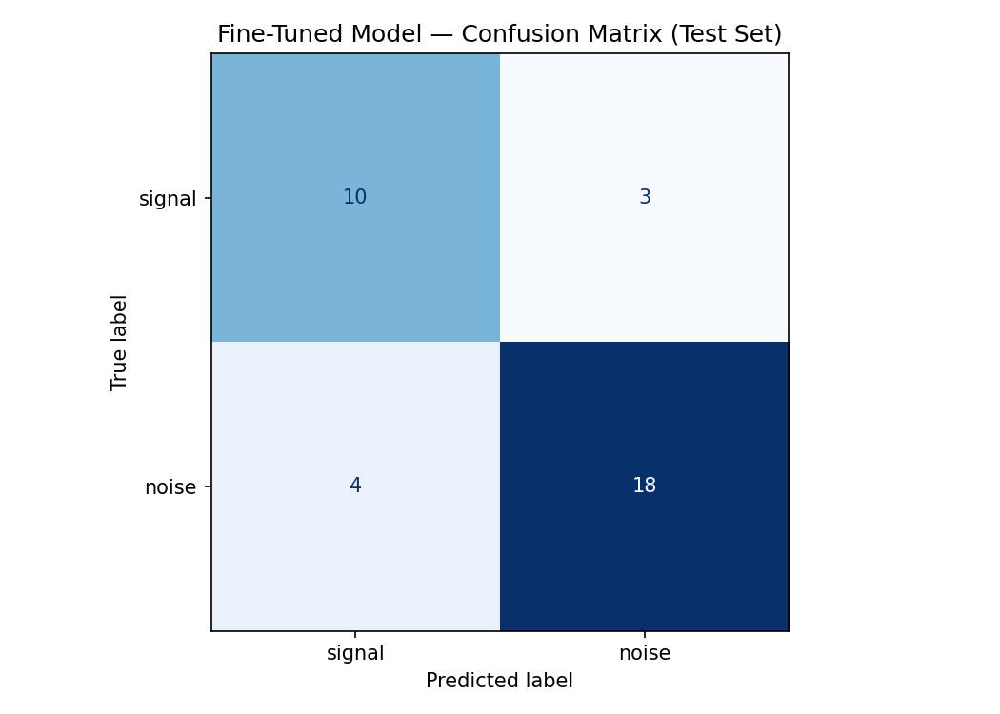

# TakeMeter 🚀📊

A binary text classifier that reads a **r/wallstreetbets** post and decides whether it carries a real, reasoned *take* — **Signal** — or whether it's ambient **Noise** (hype, questions, PSAs, social chatter).

WSB during the GameStop squeeze had a notoriously low signal-to-noise ratio. TakeMeter is a "take meter" that surfaces the small fraction of posts actually worth reading and filters out the firehose.

> This repository holds everything **outside** the Colab notebook: planning, the labeled dataset, and the evaluation outputs downloaded from Colab. The model training/evaluation itself lives in the Colab notebook.

## Labels

| Label | Name | Definition |
|-------|------|------------|
| `signal` | **Signal** | The post advances an original, reasoned position about a security/market/strategy, supported by evidence or analysis (data, options/short math, a comparison, a mechanism, a worked thesis) — something a reader could argue *with*. |
| `noise` | **Noise** | The post advances no supported analytical claim: a question, a rally cry / hype, a celebration, a meta/news post, or a PSA. |

Full definitions, example posts, and the signal/noise edge-case rules are in **[planning.md](planning.md)**.

## Dataset

- **Source:** Kaggle [Reddit WallStreetBets Posts](https://www.kaggle.com/datasets/gpreda/reddit-wallstreetsbets-posts) (`reddit_wsb.csv`, ~349k rows, Jan–Mar 2021).
- **Labeled working set:** [`wsb_to_label.csv`](wsb_to_label.csv) — columns `id, title, text, score, label`.
- **Class balance:** Signal is the minority class (~30%), reflecting WSB's real base rate. See planning.md §4–§5 for how this drives the metric choices.

> `reddit_wsb.csv` (~39 MB) is **gitignored**. Download it from the Kaggle link above and place it in the repo root to reproduce sampling.

## Evaluation

Results produced in Colab and saved here:

- [`outputs/evaluation_results.json`](outputs/evaluation_results.json) — per-class precision/recall/F1, macro-F1, and the always-N baseline.
- [`outputs/confusion_matrix.png`](outputs/confusion_matrix.png) — error directions (missed Signal vs. false alarms).

**Why not accuracy?** With a ~64/36 split, always predicting Noise scores ~63% accuracy while catching zero Signal (macro-F1 ≈ 0.41). The headline metric is **macro-F1**, with **Signal precision/recall** as the deployment-critical numbers. Success targets are defined in planning.md §6.

### Results (test set, n=35 — 13 signal / 22 noise)

| Model | Accuracy | Macro-F1 | Signal P | Signal R | Signal F1 |
|-------|:--------:|:--------:|:--------:|:--------:|:---------:|
| Majority baseline (always-noise) | 0.63 | 0.41 | — | 0.00 | 0.00 |
| Groq `llama-3.3-70b` (zero-shot prompt) | 0.77 | 0.76 | 0.67 | 0.77 | 0.71 |
| **DistilBERT (fine-tuned)** | **0.80** | **0.79** | **0.71** | **0.77** | **0.74** |

Against the planning.md §6 "good enough" bar, the **fine-tuned model passes all three criteria**: macro-F1 0.79 ≥ 0.75, Signal recall 0.77 ≥ 0.70, Signal precision 0.71 ≥ 0.65 — and both models crush the always-noise floor (0.41). Neither reaches the higher *deployment-grade* Signal precision ≥ 0.80 yet (best is 0.71).

**Two honest findings:**

1. **Data volume was the dominant lever, not hyperparameters.** Growing the labeled set from 63 → 82 Signal examples lifted the fine-tuned model's test macro-F1 from **0.64 → 0.79**. A separate config bug (warmup steps exceeding total training steps, plus selecting the best checkpoint on accuracy instead of macro-F1) had earlier collapsed the model into predicting Noise for everything — fixing those was the precondition for the model learning at all.
2. **A zero-shot 70B LLM nearly matches a fine-tuned model here.** On 35 test examples the fine-tuned model (0.79) and the prompt-only baseline (0.76) differ by ~1 example — effectively a tie. At this data scale, prompting a large instruction model is a strong, training-free baseline.

> ⚠️ **Small-sample caveat:** the test set is only 35 examples (13 signal). A single flipped prediction moves macro-F1 by ~3–5 points, so 0.79 vs 0.76 is *not* a meaningful gap, and "passes §6" should be read as "clears the bar on a noisy estimate." The clearest next step is more labeled data (planning.md §4).

The fine-tuned confusion matrix (7 errors: 3 missed Signal, 4 false alarms):



### Error Analysis (fine-tuned model, all 7 errors reviewed by hand — planning.md §7c)

The 7 misclassifications fall into two clean patterns:

- **False alarms (4) — "costume of analysis."** The model flags financial vocabulary, tickers, numbers, and the word "DD" as Signal even when there is no original argument: a short-interest **data list**, an **earnings-data compilation** (its most *confident* error, 0.92), a name-dropping vaccine pitch, and a meta-rant *about* DD culture. It learned the surface features of analysis, not the §2 "supported original claim" test.
- **Missed Signal (3) — buried, tentative, or external.** All low-confidence (0.50–0.66): analysis phrased conversationally ("someone mentioned… Investopedia says…"), a real DD whose calculation sat *below* a chatty preamble and past the 256-token truncation window, and a post that puts its argument in an **external video** ("watch and decide").

The errors are symmetric and almost all low-confidence — the model is uncertain exactly where the §3 edge cases live, not wildly wrong.

**Label-quality finding (honest).** Hand-verification showed at least one "error" — the external-video post — should be **Noise** under our own §3 rule (*judge the post's own text, not what it links to*); it was mislabeled Signal in a not-fully-careful annotation pass. So the dataset carries some label noise and the model's true accuracy is **at least** the reported 0.79. We deliberately did **not** edit the held-out test labels to reflect this (that would tamper with the test set); we report it instead. A §3-driven consistency relabel over the *full* dataset, applied blind to predictions, is the correct fix — listed as future work.

**Actionable next steps:** (1) more training examples teaching "data dump / external link ≠ Signal"; (2) feed `title + body` and widen the truncation window so buried DD isn't cut off; (3) the consistency relabel above.

## AI Usage Disclosure

AI tools (Claude) were used in these ways:

1. **Documentation & notebook debugging** — Claude helped draft planning.md / README / edge_cases.md, and debugged the Colab notebook. It found and fixed a label-space mismatch (the parser lowercased model output while `LABEL_MAP` used uppercase keys, which would have made 100% of responses unparseable) and the fine-tuning config bugs — warmup steps exceeding total training steps, selecting the best checkpoint on accuracy instead of macro-F1, and missing class weights — that had initially collapsed the model into predicting Noise for everything.
2. **Annotation assistance** — to address Signal underrepresentation (planning.md §4), Claude generated a *targeted candidate pool* from the ~50k raw posts, ranked by DD/analysis keywords, body length, and comment count, to surface likely-Signal examples. **Every candidate was then labeled by hand**; no LLM-applied label was accepted automatically. (The planned `prelabeled` pre-labeling workflow was not used — candidates were labeled cold.)
3. **Failure analysis** — the fine-tuned model's wrong predictions were reviewed for recurring error patterns (planning.md §7c), verified by hand against the posts.

All labeling decisions and the final evaluation were made or verified by the human author.

## Repository Layout

```
ai201-project3-takemeter/
├── planning.md               # design: community, labels, edge cases, metrics, AI plan
├── README.md                 # this file
├── wsb_to_label.csv          # labeled working dataset
├── reddit_wsb.csv            # raw source (gitignored — get from Kaggle)
├── edge_cases.md             # running log of signal/noise boundary calls (created during annotation)
└── outputs/                  # downloaded from Colab
    ├── evaluation_results.json
    └── confusion_matrix.png
```
